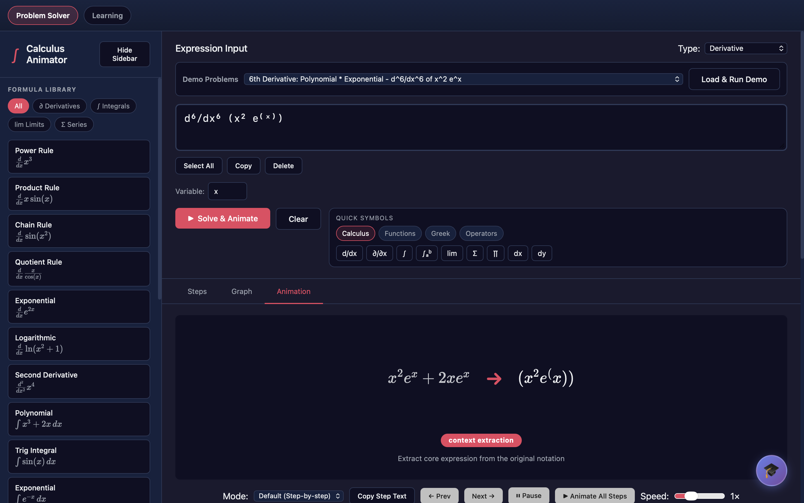
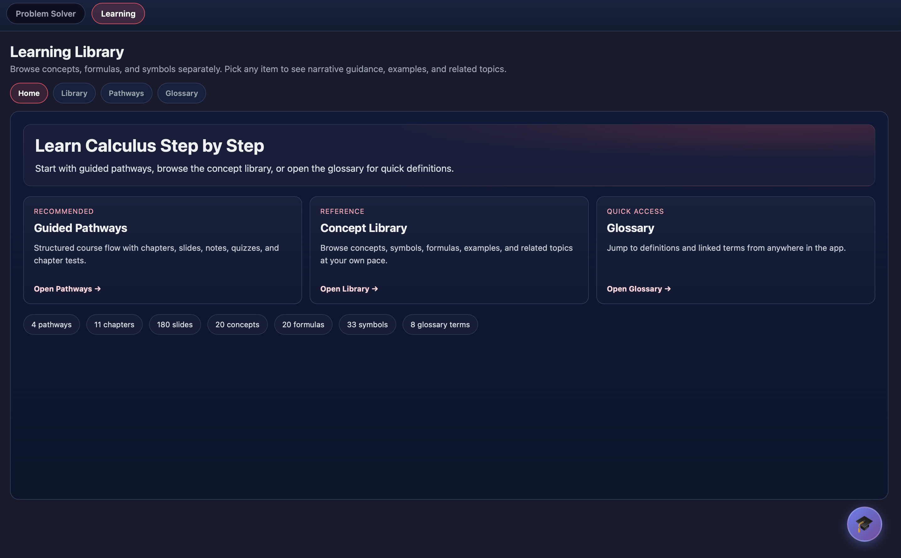
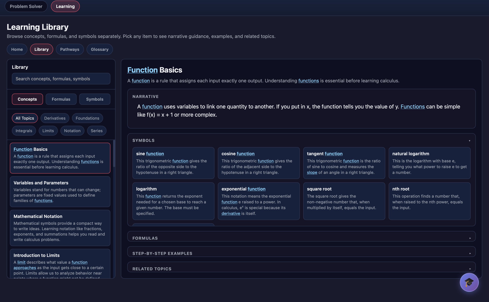
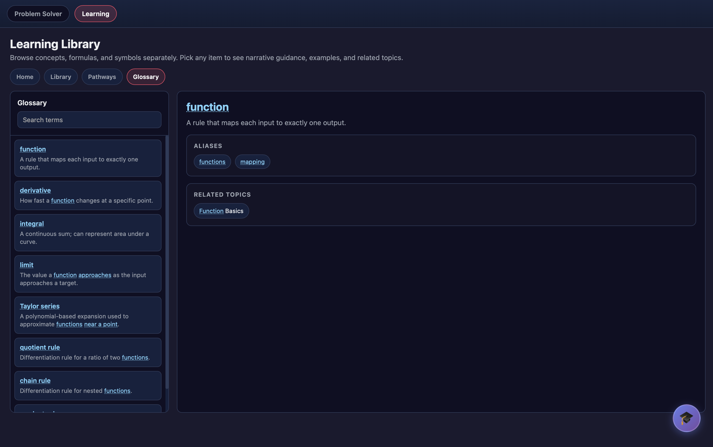

# Calculus Animator

An educational calculus platform demonstrating modern AI integration patterns: multi-provider LLM routing, RAG-based knowledge retrieval, and vision-enabled tutoring.

[](https://github.com/Rsan0948/calculus_animator/actions/workflows/ci.yml)
[](https://www.python.org/downloads/)
[](https://opensource.org/licenses/Apache-2.0)
[](https://github.com/astral-sh/ruff)

## Overview

Calculus Animator bridges symbolic mathematics with interactive visualization and AI tutoring. Enter any calculus expression, and the system automatically detects the operation, solves it symbolically using SymPy, and generates step-by-step animations with live graphs.

The platform showcases production-ready AI system architecture: provider-agnostic LLM integration, retrieval-augmented generation for educational content, and multi-modal tutoring with screenshot analysis.

## Screenshots


*Problem Solver — expression input, step-by-step animation, and formula library*


*Learning Library — guided pathways, concept library, and glossary*


*Concept Library — narrative explanations, symbols, and formulas*


*Glossary — linked definitions with aliases and related topics*

## Architecture

> **For runtime / IPC / lifecycle details, see [docs/architecture.md](docs/architecture.md).** This section gives the high-level overview; the architecture doc has the process model, message shapes, watchdog behavior, and the configuration surface.

### System Design

```
┌─────────────────────────────────────────────────────────────────┐
│  Desktop Application (PyWebView)                                │
│  ├── Web UI (HTML/CSS/JS) - Problem input, visualization        │
│  └── AI Tutor Panel - Socratic dialogue, screenshot analysis    │
└──────────────────┬──────────────────────────────────────────────┘
                   │ HTTP/WebSocket
                   ▼
┌─────────────────────────────────────────────────────────────────┐
│  Python Bridge (FastAPI)                                        │
│  ├── /solve - Symbolic computation pipeline                     │
│  ├── /render - Slide generation with subprocess workers         │
│  └── /tutor/chat - AI tutoring with RAG + vision                │
└──────────────────┬──────────────────────────────────────────────┘
                   │
     ┌─────────────┼─────────────┐
     ▼             ▼             ▼
┌─────────┐  ┌──────────┐  ┌────────────┐
│  SymPy  │  │  AI      │  │  ChromaDB  │
│  Engine │  │  Router  │  │  (RAG)     │
└─────────┘  └────┬─────┘  └────────────┘
                  │
        ┌─────────┼─────────┐
        ▼         ▼         ▼
   ┌────────┐ ┌────────┐ ┌────────┐
   │DeepSeek│ │ Gemini │ │ Ollama │
   └────────┘ └────────┘ └────────┘
```

### Key Architectural Decisions

#### 1. PyWebView for Desktop Distribution

**Decision:** Use PyWebView (Python backend + HTML/CSS/JS frontend) instead of Electron or pure PyQt.

**Rationale:**
- Leverage web technologies for UI while keeping Python ecosystem for math/ML
- Single codebase for cross-platform desktop (Windows, macOS, Linux)
- Native OS integration without bundling Chromium
- Smaller distribution size (~80MB vs ~200MB for Electron)

**Trade-offs:** Requires Python runtime on target machine (acceptable for educational software).

#### 2. Subprocess Worker Isolation

**Decision:** Run slide rendering and text measurement in separate subprocesses.

**Rationale:**
- pygame rendering can hang or crash; isolation protects main process
- Enables CPU-bound operations (SymPy simplification, graph generation) without blocking UI
- Memory isolation prevents renderer leaks from affecting solver state
- Clean shutdown: workers can be killed/restarted independently

**Implementation:**
```
api/slide_render_worker.py      # pygame-based slide generation
api/capacity_slide_worker.py    # text measurement and fitting
```

#### 3. FastAPI Bridge Pattern

**Decision:** Expose Python functionality via FastAPI rather than direct Python-JS binding.

**Rationale:**
- Language-agnostic: JavaScript frontend can call Python without PyInstaller complications
- Standard HTTP/WebSocket patterns enable future mobile/web ports
- Async/await support for concurrent operations (solving + rendering + AI)
- Built-in OpenAPI documentation and request validation

#### 4. SymPy + Custom Step Extraction

**Decision:** Use SymPy for symbolic computation but implement custom step extraction.

**Rationale:**
- SymPy handles the heavy lifting (differentiation, integration, limits)
- Custom step generator converts SymPy's internal representations into human-readable animation frames
- Enables pedagogical ordering (show substitution before evaluation, highlight chain rule applications)

**Pipeline:**
```
LaTeX Input → SymPy Parser → Solver → Step Extractor → Animation Frames
```

## AI Integration

### Multi-Provider LLM Router

The AI tutor supports multiple LLM providers with unified interface:

```python
# Provider router automatically handles:
# - API key management
# - Request/response formatting
# - Error handling and fallbacks
# - Token counting and rate limiting

providers = {
    "deepseek": DeepSeekProvider(api_key=os.getenv("DEEPSEEK_API_KEY")),
    "google": GeminiProvider(api_key=os.getenv("GOOGLE_API_KEY")),
    "openai": OpenAIProvider(api_key=os.getenv("OPENAI_API_KEY")),
    "ollama": OllamaProvider(base_url="http://localhost:11434"),
}
```

**Key Design:** Provider-agnostic interface enables:
- Cost optimization (route to cheapest provider)
- Capability matching (vision tasks → Gemini, reasoning → DeepSeek)
- Fallback chains (if OpenAI fails, fall back to local Ollama)
- A/B testing different models for tutoring effectiveness

### RAG-Based Curriculum Search

The AI tutor retrieves relevant educational content before generating responses:

```
User Question
     ↓
Embedding (sentence-transformers)
     ↓
ChromaDB Vector Search (top-5 concepts)
     ↓
Prompt Augmentation
     ↓
LLM Response (grounded in curriculum)
```

**Benefits:**
- Responses reference actual course content, not hallucinated explanations
- Consistent terminology with the student's curriculum
- Relevant formula and rule reminders included automatically

### Vision-Enabled Tutoring

Students can attach screenshots of their work:

```
[Student Question] + [Screenshot of handwritten work]
           ↓
    Gemini Vision API (multimodal)
           ↓
    AI analyzes both text and image
           ↓
    Socratic guidance referencing visual elements
```

**Implementation:** Base64-encoded images sent via FastAPI, processed by Gemini Pro Vision or GPT-4V depending on provider configuration.

### Context Injection

The AI tutor knows:
- Current problem being solved
- Current step in the animation
- Previous conversation history
- Relevant curriculum concepts (via RAG)
- Attached screenshot (if provided)

**Prompt Template Excerpt:**
```
You are a Socratic calculus tutor. The student is working on:
Problem: {latex_expression}
Current Step: {step_number} of {total_steps}
Operation: {operation_type}

Relevant concepts from curriculum:
{retrieved_concepts}

Student question: {question}

Guidelines:
- Ask guiding questions, don't give answers
- Reference specific parts of their work if screenshot attached
- Connect to curriculum concepts when relevant
```

## Testing Strategy

We employ a comprehensive testing pyramid:

### Unit Tests (`tests/test_*.py`)
- **Parser tests:** LaTeX → SymPy conversion for edge cases
- **Detector tests:** Operation type classification accuracy
- **Solver tests:** Step extraction correctness
- **Extractor tests:** Parameter and inner expression parsing

**Run:** `make test` or `python scripts/run_tests.py --quick`

### Integration Tests
- **Bridge contract tests:** Python ↔ JavaScript API compatibility
- **Worker tests:** Subprocess lifecycle and communication
- **Animation engine:** Frame generation and timing

**Run:** `make test` or `python scripts/run_tests.py`

### End-to-End Tests
- **Backend smoke tests:** Full solve → render pipeline
- **UI smoke tests:** Webdriver-based user flow validation
- **Cross-platform:** Windows, macOS, Linux verification

**Run:** `make test-e2e` or `python scripts/run_tests.py --e2e`

### Property-Based Fuzz Tests
Using Hypothesis to generate random valid calculus expressions:

```python
@given(st.from_regex(r'\d+x\^\d+', fullmatch=True))
def test_parser_never_crashes(expression):
    # Property: Parser should never crash on valid input
    result = parse_latex(expression)
    assert result is not None
```

**Run:** `make test-fuzz` or `python scripts/run_tests.py --fuzz`

### Snapshot Regression Tests
- **Curriculum slides:** Visual regression testing for slide rendering
- **Solver outputs:** Golden master testing for step sequences
- **Performance benchmarks:** Rendering time thresholds

**Run:** `make test-full` or `python scripts/run_tests.py --full`

### Quality Assurance

```bash
# Linting
make lint           # or: ruff check .

# Type checking
make type-check     # or: mypy api core

# Full QA pipeline (lint + type + tests)
make quality        # or: python scripts/run_quality.py

# Release checklist
make release-check  # or: python scripts/run_release_checklist.py
```

## Installation

### Requirements
- Python 3.10+
- Windows, macOS, or Linux

### Quick Start

```bash
git clone https://github.com/Rsan0948/calculus_animator.git
cd calculus_animator
python -m venv .venv && source .venv/bin/activate    # Windows: .venv\Scripts\activate
pip install -e .                                      # core only
python run.py
```

For the full app with AI tutoring:

```bash
pip install -e '.[ai_tutor]'                          # adds ChromaDB + sentence-transformers
```

For the dev/test toolchain (ruff, mypy, pytest, hypothesis, playwright):

```bash
pip install -e '.[dev]'
```

For the release-build toolchain (PyInstaller):

```bash
pip install -e '.[build]'
```

The same install paths work via the explicit requirements files (`requirements.txt`, `requirements-ai.txt`, `requirements-dev.txt`) for environments that prefer them. `run.py` will check and install any missing runtime deps before launching.

### Verify Installation

```bash
python scripts/smoke_test.py
```

This runs three checks (backend constructs cleanly, bridge capacity probe responds, render pipeline completes a slide end-to-end) and exits 0 on success. Use it after a fresh install or as a CI gate.

### First-Run Notes

- The first slide render after a cold start takes **~6–19s on Apple Silicon** while pygame initializes the persistent render worker. Subsequent renders are fast. This is not a hang; do not kill the process.
- `python run.py --help` and `python run.py --version` short-circuit before launching the desktop window — handy for scripted environments.

### AI Tutor Setup (Optional)

Copy `.env.example` to `.env` and fill in your API key:

```bash
cp .env.example .env
# Edit .env and set your preferred provider + key
```

```bash
# Option 1: DeepSeek (default, set LLM_PROVIDER=deepseek)
DEEPSEEK_API_KEY=your-key-here

# Option 2: Google Gemini (free tier, supports vision)
LLM_PROVIDER=gemini
GOOGLE_API_KEY=your-key-here

# Option 3: Local Ollama (free, offline)
LLM_PROVIDER=local
# No API key needed — run: ollama pull mistral
```

Then start the app normally:

```bash
python run.py
```

See [AI_TUTOR_QUICKSTART.md](docs/AI_TUTOR_QUICKSTART.md) for detailed setup.

## Usage

### Problem Solver
1. Enter a LaTeX expression (e.g., `\frac{d}{dx} x^3 \sin x`)
2. Operation auto-detected, or select manually
3. Click **Solve** for step-by-step solution
4. Use playback controls for animation

### AI Tutor
1. Click the 🎓 button (bottom-right) or press **?**
2. Ask questions about the problem or steps
3. Attach 📷 screenshots for vision analysis
4. Receive Socratic guidance

## Supported Operations

| Operation | Example Input |
|-----------|---------------|
| Derivative | `\frac{d}{dx} x^3 \sin x` |
| Higher-order derivative | `\frac{d^2}{dx^2} e^x \cos x` |
| Indefinite integral | `\int x^2 e^x \, dx` |
| Definite integral | `\int_0^1 x^2 \, dx` |
| Limit | `\lim_{x \to 0} \frac{\sin x}{x}` |
| Taylor series | Taylor expansion of `e^x` at `x=0` |
| ODE | `y' - 2y = 0` |
| Simplification | Any algebraic expression |

## Project Structure

```
calculus_animator/
├── run.py                  # Entry point — start here
├── window.py               # PyWebView window configuration
├── config.py               # App-wide settings and paths
├── Makefile                # Dev shortcuts (make test, make quality, etc.)
├── api/                    # FastAPI bridge and workers
│   ├── bridge.py          # JS-callable API endpoints
│   ├── slide_render_worker.py
│   └── capacity_slide_worker.py
├── core/                   # Symbolic math engine
│   ├── parser.py          # LaTeX → SymPy
│   ├── detector.py        # Operation classification
│   ├── extractor.py       # Expression parsing
│   ├── solver.py          # SymPy integration + step extraction
│   ├── step_generator.py  # Animation frame generation
│   ├── animation_engine.py # Graph computation
│   └── slide_highlighting.py # Content analysis
├── ai_tutor/               # AI tutoring system
│   ├── main.py            # FastAPI server
│   ├── providers/         # LLM provider implementations
│   ├── rag/               # Curriculum search (ChromaDB)
│   └── routers/           # API endpoints
├── ui/                     # Web-based frontend
│   ├── index.html
│   ├── ai_tutor/          # Tutor panel components
│   └── js/app.js
├── slide_renderer/         # pygame rendering engine (package)
│   ├── engine.py          # SlideEngine — core renderer
│   ├── _elements.py       # Slide element classes
│   ├── _font.py           # Font cache and text helpers
│   ├── _themes.py         # Theme definitions
│   ├── _drawing.py        # Drawing primitives
│   └── _enums.py          # Anchor, Transition, EntryAnim
├── data/                   # Curriculum, formulas, glossary JSON
├── assets/                 # Fonts and static assets
├── scripts/                # Dev tooling (test runner, build, QA)
├── docs/                   # Extended documentation
└── tests/                  # Comprehensive test suite
```

## Development

### Running Tests

```bash
make test           # Fast unit + integration suite
make test-full      # Full suite including snapshots
make test-fuzz      # Property-based fuzz tests (slow)
make test-e2e       # End-to-end backend tests

# Windows (no make):
python scripts/run_tests.py
python scripts/run_tests.py --full
```

### Code Quality

```bash
# Linting (correctness — F-class — across the whole repo)
ruff check . --select F

# JS linting (ui/js/**/*.js, excludes ui/vendor/)
npm install --no-audit --no-fund    # one-time
npm run lint

# Type checking (actively-maintained packages)
mypy api core ai_tutor

# Formatting
ruff format .

# Security scans (run by CI on every PR)
pip-audit -r requirements.txt -r requirements-dev.txt --strict
bandit -r api core ai_tutor -ll

# Test coverage (CI enforces ≥50% across api + core + ai_tutor)
pytest -m "not gui" --cov=api --cov=core --cov=ai_tutor --cov-fail-under=50
```

CI gates: ruff `--select F` over the whole repo, ESLint over `ui/js/`, mypy over `api core ai_tutor`, `pytest -m "not gui"` with `--cov-fail-under=50`, `pip-audit`, and `bandit`. See `.github/workflows/ci.yml` for the live configuration. Heavier scans (fuzz/perf/E2E UI) run on a Mon/Thu cron in `.github/workflows/extended-quality.yml`.

### Building Releases

```bash
make build          # or: python scripts/build_release.py
# Output: dist/Calculus-Animator-*.zip
```

## Known Issues

- **Parser edge case**: Certain nested trigonometric expressions like `cos(x)` in complex fractions may not parse correctly, causing graph rendering to fail. The solver still works; only the visualization is affected. Tracked in [#2](https://github.com/Rsan0948/calculus_animator/issues/2).

## Roadmap

### Planned Refactors

**`api/bridge.py` — split into focused modules**
`CalculusAPI` currently handles worker lifecycle management, all JS-callable endpoints, curriculum loading, and LRU caching in a single class. The planned split:
- `api/workers.py` — worker process management (`_start_render_worker`, `_run_render_task`, `__del__`)
- `api/data_loaders.py` — JSON/curriculum loading and normalization
- `api/endpoints.py` — JS-callable methods only (`solve`, `get_graph_data`, etc.)

This is a tracked architectural debt, not a bug. The current structure works correctly; the refactor is deferred until the API surface stabilizes.

### Planned Features

- **Windows/Linux packaging** — PyInstaller build pipeline for non-macOS platforms
- **Implicit differentiation** — extend solver for `F(x, y) = 0` forms
- **Multivariable limits** — partial derivatives and mixed partials
- **Export** — save solved steps as PDF or LaTeX document

## License

Apache 2.0 — see [LICENSE](LICENSE)

## Acknowledgments

- SymPy for symbolic mathematics
- PyWebView for cross-platform desktop wrapper
- Pygame for rendering engine
- Sentence-Transformers for embeddings
- ChromaDB for vector search
